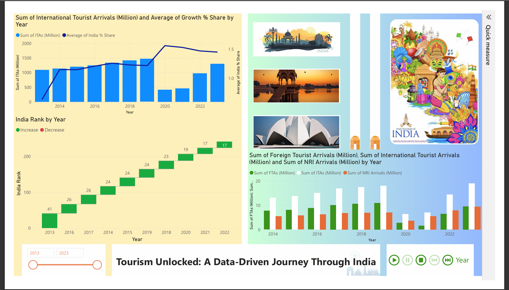

# tourism-analysis-dashboard
Power BI dashboard analyzing tourism trends, growth patterns, and insights for India
# 🌏 Tourism Unlocked: India Tourism Analytics Dashboard

> A data-driven dashboard designed to analyze tourism trends, identify growth patterns, and support strategic decision-making.

---

## 📌 Overview
This project analyzes tourism data in India to understand international arrivals, growth trends, and global positioning using Power BI.

---

## 📷 Dashboard Preview

---

## 🎯 Business Problem
Tourism growth in India has been inconsistent and impacted by external factors, making it difficult for stakeholders to track trends and plan strategies.

---

## 🛠 Tools Used
- Power BI  
- Excel  

---

## 📊 Key Insights
- Strong growth observed before 2020  
- Sharp decline due to COVID-19 pandemic  
- Rapid recovery post-2021  
- India’s global tourism ranking improving  
- NRI segment shows stable contribution  

---

## 💡 Business Recommendations
- Strengthen global tourism branding  
- Diversify target tourist markets  
- Promote niche tourism (spiritual, medical, cultural)  
- Build crisis-resilient tourism strategies  

---

## 📁 Project Files
- Power BI Dashboard (.pbix)  
- Dataset  
- Screenshots  

---

## 🚀 How to Use
1. Download the `.pbix` file  
2. Open in Power BI Desktop  
3. Explore trends using filters  

---
